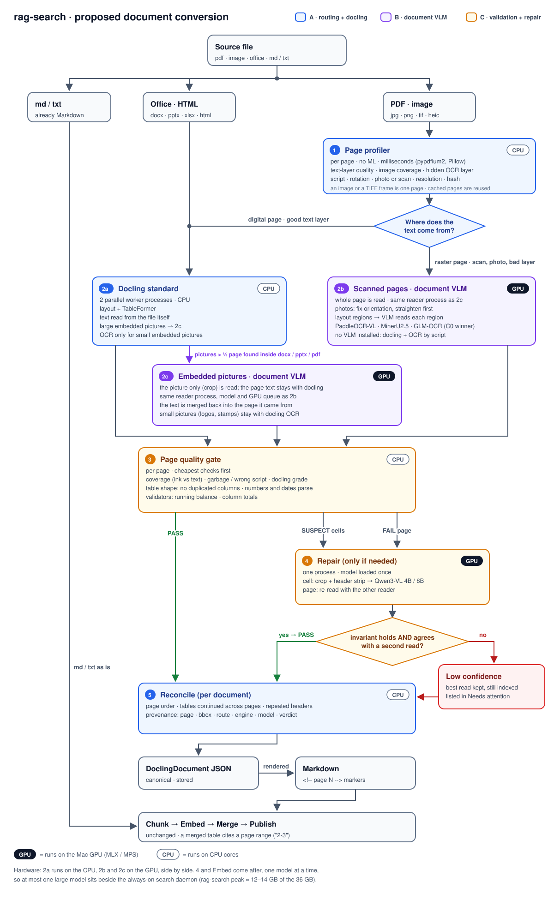
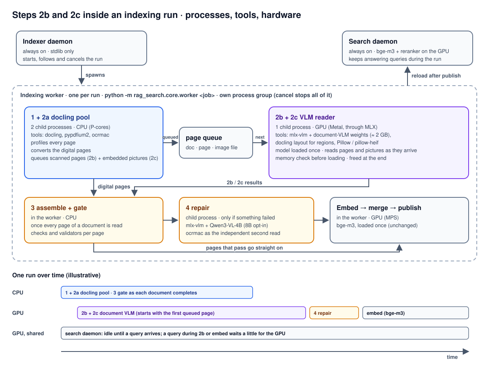

# Document conversion: critical evaluation and options (scanned PDFs, tables, images)

Status: analysis and proposal (2026-10-02), **not implemented**. Input: the author's draft "page-level
routing + quality gate + VLM fallback" ingestion design. Target machine: Apple Silicon MacBook Pro
(M4 Max, 36 GB, shared with other apps). Revised the same day after the author's answers: GPU work stays
native on the Mac, no container for it (§11).
Current design: `../../ARCHITECTURE.md` §5.1 step 3 and `src/rag_search/core/docling_convert.py`.

## 1. Summary

The draft's direction is right on four points: decide **per page**, not per PDF; **validate**
every page instead of trusting the converter; use **domain checks** such as running balances;
and keep a **structured representation**, rendering Markdown from it. Today rag-search does
none of these.

It needs changes on six points:

1. **Route on two axes, not four page classes.** The first axis is where the page's text comes
   from: a trustworthy text layer, or the page image. That is a cheap, page-level decision.
   The second axis is what each *region* on the page is: text, table, form, picture. A layout
   model answers that better than line-density heuristics, and the pipeline needs one anyway.
   "Scanned table page" vs "scanned text page" is the wrong cut, because most real pages
   are both.
2. **Small document VLMs are no longer a last resort.** Models of 0.9–1.2 B parameters built
   for documents now lead the public document-parsing benchmarks, ahead of classic OCR plus
   table-structure pipelines and ahead of 70–200 B general VLMs. They run on an M4 through
   MLX. They should be the *default* reader for raster pages. The expensive *general* VLM
   (Qwen-class, 7 B+) is the right last resort, and only for targeted repair.
3. **Fewer engines, not more.** Docling + Tesseract/RapidOCR + PaddleOCR/PP-Structure + a VLM
   means three or four ML runtimes (torch, paddle, onnx, mlx). Each would load in every
   parallel conversion worker, inside a laptop's memory and a container image's size. Pick one
   raster reader and one repair model.
4. **The quality gate must not rely on confidence scores.** OCR confidence is poorly calibrated
   and VLMs report none: a hallucinated number looks exactly like a correct one. The gate
   should rely on structural and domain invariants plus agreement between independent reads.
5. **Language and script are missing, and they are the biggest silent failure in the current
   corpus.** Marathi (Devanagari) pages in property deeds come out as Latin gibberish today
   (§2).
6. **No cloud model in the pipeline.** rag-search's design rule is "everything is local". The
   documents are financial and property records. Gemini can be a one-off benchmark reference
   on non-sensitive samples, nothing more.

Recommended path: a measurement harness on a gold set built from this corpus first. Then
page-level routing within docling (no new dependencies). Then a document VLM for raster
pages, run natively on the Mac's GPU (MLX) as one child process of the indexing run. Then
validators with targeted repair. Details in §6–§8; the whole flow as a chart at the start of
§6. Steps 2b and 2c in detail: §12; image files: §13; speed and CPU/GPU use on the M4 Max: §14.

## 2. What happens today, with evidence from the indexed corpus

`docling_convert.py` runs docling's standard pipeline with layout analysis and TableFormer
(accurate). It uses `RAG_SEARCH_OCR=force` by default, which renders and OCRs every page of
every PDF, born-digital ones included. `smart` decides once per PDF from 12 sampled pages.
OCR engine `auto` means Apple Vision (ocrmac) on the Mac. Docling's per-page confidence report
(layout, OCR and parse scores with grades, available since docling 2.34) is thrown away.
Only Markdown is kept, one `<!-- page N -->` block per page. The `DoclingDocument`, with
bounding boxes and table cells, is discarded.

Looking at what this produced in the `documents` collection (1,220 documents, read with
`rag_grep`):

| Failure | Example in the converted Markdown | Cause |
|---|---|---|
| Devanagari pages become Latin gibberish | a scanned deed page: Latin gibberish; only one of 1,220 documents contains any Devanagari | OCR engine/language not chosen per script. Apple Vision does not appear to cover Indic scripts (worth confirming with `supportedRecognitionLanguages` on the Mac) |
| OCR errors in what are probably born-digital statements | a statement: a Cyrillic look-alike letter inside `(Cr)`, a lower-case L for the I of a payment reference | `force` OCRs pages whose text layer was exact |
| Table header flattened with page furniture | a statement's column header run together with page furniture | layout/table structure on a dense scanned header |
| Duplicated columns | a worksheet row: `| item | item | 0.00 |` | spanning-cell expansion repeated the text |
| Rows merged, values in the wrong column | two labels and an amount in one cell; two amounts in one cell | row/column segmentation on scans |
| Scanned passbooks unusable | the PPF passbooks in the index are **hand transcriptions** (`.md` files with "Transcription Notes": "line 10 is reconstructed from the balances") | conversion was not trusted. The balance arithmetic was used by hand, which is exactly the validator the draft proposes |

So the problem is real, and its shape is clear: numeric tables on scans, non-Latin scripts, and
damage done to good pages by forced OCR.

## 3. Point-by-point evaluation of the draft

| Draft element | Verdict | Comment |
|---|---|---|
| Page-level routing, merge back in page order | **Keep** | Essential. A cheap version is possible today with pypdfium2, which docling already installs. |
| Page profiler signals (text layer, image area, fonts) | **Keep, add three** | (a) *Invisible OCR layers*: scanner apps (a scanner app's name appears in the corpus) put a text layer over a full-page image. "Has text" does not mean "born digital", so check text-render mode and image coverage, and grade the text layer's quality. (b) **Script detection** (Latin vs Devanagari…) to pick the engine and language. (c) Orientation/skew. |
| Classes NATIVE / SCANNED_TEXT / SCANNED_TABLE / COMPLEX | **Replace** | The text source is page-level. Content type is region-level and comes from the layout model (docling Heron, PP-DocLayout). Detecting tables with line density and x-alignment is brittle: borderless tables, ruled forms and passbook grids all break it. |
| Docling for native pages | **Keep** | Without forced OCR. Docling's `auto` mode still OCRs embedded bitmaps such as stamps and signatures. |
| RapidOCR/Tesseract + Docling for scanned text | **Fallback only** | RapidOCR runs the same PP-OCR model family through ONNX. Tesseract is weak on tables and degraded scans. Keep docling+OCR as the dependency-free baseline when no VLM is installed. |
| PaddleOCR / PP-Structure for scanned tables | **Superseded** | The Paddle project's own state of the art is now PaddleOCR-VL (0.9 B). On Apple Silicon its layout stage runs in PaddlePaddle on CPU only, and the VLM stage through mlx-vlm. That adds a second deep-learning runtime next to torch. |
| VLM only when necessary | **Refine** | True for general VLMs (Qwen-class: about 0.4 pages/s on an M5 Max at 7 B). Not true for 1 B document VLMs, which are reasonable as the primary raster reader. |
| Per-page quality gate with verdicts PASS / RETRY / TARGETED / FULL_PAGE / MANUAL | **Keep, change the inputs** | Use invariants (§5), cross-read agreement and docling's grades, not raw OCR confidence. |
| Domain checks (balance arithmetic) | **Keep: highest value** | Implement as optional *validators*, chosen by recognising the table (a running-balance table has Date + Debit/Credit + Balance columns). One validator covers bank statements, PF and PPF passbooks. |
| Crop the bad cell and send it to a VLM | **Keep, with care** | Needs cell geometry (TableFormer and PaddleOCR-VL provide it). Send the crop together with the header strip, so the model knows which column it is reading. Accept the answer only if it makes the invariant hold *and* is consistent with the OCR glyphs (a "grounding" check), otherwise the VLM is just guessing a number that balances. |
| VLM output validation | **Specify** | As drafted it is a rubber stamp. Check numbers against an independent read; reject text that does not appear on the page. Use temperature 0 and record the model and version. |
| Manual review / quarantine | **Adapt** | A personal tool must not block indexing. Index the best read, mark its chunks low-confidence, and list the document under the Collections tab's *Needs attention*. |
| Document reconciliation (cross-page tables, repeated headers, provenance) | **Keep** | Note: the chunker splits at page markers today, so a merged table needs chunks that cover a page range (§6). |
| JSON as the canonical form, Markdown rendered from it | **Keep, don't reinvent** | `DoclingDocument` already is that JSON. It has pages, bounding-box provenance, table cells with spans, and confidence. Store it, and add route/engine/validation metadata. |
| Gemini as cloud fallback/reference | **Reject in the pipeline** | Breaks local-only and privacy for financial/property records. At most an offline reference on chosen samples. |
| Benchmark PaddleOCR-VL, MinerU2.5-Pro, Qwen2.5-VL, Gemini | **Update the list** | Qwen2.5-VL is two generations old (Qwen3-VL / Qwen3.5). Add GLM-OCR (0.9 B, MIT, runs in MLX) and PaddleOCR-VL-1.6 (May 2026). Measure on *this* corpus (§7). |

Also missing from the draft:

- **Caching per page.** Key it on page-content hash + route + engine/model version, so that
  changing one engine re-reads only the pages it handled. Today a conversion-profile change
  re-converts every document.
- **Reproducibility.** The route and model per page belong in the fingerprint (`convert_profile`)
  and in the stored document.
- **Image files.** 153 of the 1,220 documents in `documents` are images. Details in §13.
- **Handwriting and annotations.** The passbooks carry handwritten notes; decide whether they
  count as content.
- **Throughput budget.** About 1,250 documents on a laptop. The escalation stage must run
  once, with its model loaded once, like the embedding phase. It must not run inside the
  parallel conversion workers.

## 4. The tool landscape (October 2026, as far as published sources show)

| Tool | Size / licence | Fit for rag-search on an M4 |
|---|---|---|
| **Docling** standard pipeline (Heron layout, TableFormer, OCR plugins) | Apache-2.0 | Already in use. Strong on born-digital pages. TableFormer runs on CPU (MPS disabled). Has a VLM pipeline that accepts OpenAI-compatible endpoints and lists MinerU2.5-Pro, Nanonets-OCR2, DeepSeek-OCR, Granite-Docling and others. Per-page confidence report. |
| **PaddleOCR-VL-1.6** | 0.9 B, Apache-2.0 | Top OmniDocBench v1.6 score (96.3). Tables, stamps/seals, charts, handwriting, 100+ languages (Devanagari quality to be confirmed on the gold set), cross-page tables. Mac: layout on Paddle CPU + VLM through mlx-vlm. Two runtimes. |
| **MinerU2.5-Pro** (MinerU 3.x) | 1.2 B; model Apache-2.0, toolkit under a custom licence since 3.1 | OmniDocBench 95.8. Has an `vlm-mlx-engine` backend and a `hybrid` backend (text layer + VLM), and merges tables across pages. A whole toolkit, heavier than calling the model. Check the toolkit licence before shipping it in the external build. |
| **GLM-OCR** | 0.9 B, MIT | OmniDocBench 95.2, runs in MLX, can fill a JSON schema (fields). A light alternative. |
| **Granite-Docling** | 258 M, Apache-2.0 | Fastest docling-native VLM (SmolDocling-class models run at about 6 s/page on an M3 Max). Weaker on dense scanned tables. Benchmark it, don't assume. |
| **Qwen3-VL / Qwen3.5** (4–9 B, 4-bit MLX) | Apache-2.0 | General VLM. Use it for *targeted repair* (crop + question), not bulk reading. About 6–10 GB of memory. |
| Apple Vision (ocrmac / `RecognizeDocumentsRequest`) | system | Fast and on device. macOS 26 adds document structure (tables, lists, barcodes) through a **Swift-only** API (a helper binary would be needed). No Indic scripts as far as I can tell. Not available in a Linux container. |
| Tesseract 5 / RapidOCR | Apache-2.0 | CPU fallbacks. Tesseract has Marathi/Hindi traineddata. |
| Surya / Marker, Chandra OCR 2 | GPL / modified OpenRAIL-M | Good accuracy, but the licences are a problem for the external release. Skip. |
| Gemini / GPT (cloud) | closed | Not in the pipeline (§1, point 6). |

Benchmark numbers come from the public leaderboards (OmniDocBench v1.6, olmOCR-Bench). They are
not comparable across benchmarks and say nothing about bank passbooks. That is why §7
comes first.

## 5. The quality gate, made concrete

Per page, cheapest first. Each check outputs `pass`, `suspect(reason, region)` or `fail(reason)`.

1. **Coverage.** Characters extracted vs ink on the page: dark-pixel area of the rendered page
   compared with text-box area. A page with ink and no text is a fail.
2. **Garbage/script.** Share of characters outside the expected script(s). The Devanagari →
   Latin gibberish case is caught here. So is the `Сг` homoglyph case: mixed scripts inside
   one token.
3. **Docling grades.** `mean_grade` / `low_grade` per page from docling's confidence report.
   POOR means retry.
4. **Table structure.** Rectangular, no column that duplicates its neighbour (the spanning bug
   above), header not swallowing page text, numeric columns that parse as numbers, dates that
   parse as dates.
5. **Domain validators**, chosen by recognising the table:
   - Running balance: `balance[i] = balance[i-1] + credit[i] - debit[i]` within rounding.
     Interest/charge rows allowed. A failing row points at one or two cells.
   - Totals: a column equals the sum of its rows. Forms: totals and subtotals.
   - Later: validators for a specific template (Form 16, 12BB) if worth it.
6. **Cross-read agreement** (only on suspect regions). A second, independent read of the
   region (a different engine, or the VLM on the crop) must agree on every number. Text may
   disagree within an edit-distance budget.

Results: `pass` → accept. `suspect` in a few cells → targeted repair. Many failures on the
page → re-read the whole page with the other reader. Still failing → keep the best read, mark
it low-confidence, list it under *Needs attention*. The verdict, the checks and the engines
are stored per page.

## 6. Options

### The proposed flow (A + B + C together)



Steps 1, 2a, 3 and 5 are option A; 2b and 2c are option B; 4 and the validators in 3 are option C.

How to read the numbering (clarified 2026-10-02):
- **2a** docling reads digital pages. **2b** the document VLM reads *whole pages* that the
  profiler sent there: scans, photos, image files, TIFF frames. **2c** reads *pictures inside*
  Office/PDF files, which docling found while doing 2a.
- 2b and 2c are separate branches (own counts, timing, branch codes `raster`/`image` and
  `embedded`) but one process: the same reader, model and GPU queue. They differ in the unit
  read and in where the result goes. 2b's result *is* the page. 2c's result is merged into a
  page that 2a already converted; an Office file has no pages, so the unit there is a picture.
- After the gate, clean pages go straight on. Suspect or failed pages go to **4 Repair**
  (Qwen3-VL, with Apple Vision as an independent second read), which ends in pass (repaired)
  or low confidence. The gate itself never produces "low confidence".

### Option A — Tune the current docling path (smallest change, no new dependencies)

- Per-page text-source decision with pypdfium2, replacing the document-level `smart`/`force`:
  use the text layer where it is good, OCR only raster pages and bitmap regions. This fixes
  the `Сг`/`UPl` damage, and it is faster.
- OCR engine per script: Apple Vision for Latin, Tesseract `mar+hin+eng` or RapidOCR's
  Devanagari model for Indic pages.
- Store the `DoclingDocument` JSON and docling's confidence report next to the `.md`. Add
  quality checks 1–4 and show the results on the dashboard.
- **Gain:** fixes forced-OCR damage and the script problem, and makes failures visible.
  **Does not fix:** structure of scanned tables (TableFormer limits stay).

### Option B — A + a document VLM for raster pages (recommended target)

- Raster pages (and pages failing A's checks) are read by a document VLM: PaddleOCR-VL-1.6,
  MinerU2.5-Pro or GLM-OCR, whichever wins §7. Born-digital pages stay on docling.
- The VLM runs **in one child process of the indexing run, natively on the Mac** (mlx-vlm as
  a library, Metal GPU). It sits beside the docling pool: the pool profiles pages, converts
  the digital ones and queues the raster ones, and the reader loads the model once, reads
  queued pages as they arrive, and frees the model at the end. One model copy, no server to
  manage. Details in §12.
- Optional later: the same reader behind an OpenAI-compatible endpoint (`mlx_vlm.server`, or
  vLLM on a Linux GPU box), selected in `config.json`. docling's VLM pipeline already speaks
  this protocol. Not needed for the Mac.
- Converting a PDF becomes: profile pages → route page ranges (docling `page_range` per run) →
  merge the per-page results into one `DoclingDocument` in page order → render Markdown with
  page markers. The chunker stays unchanged.
- **Gain:** the large step on scanned tables, stamps and forms, and Devanagari (100+
  languages). **Cost:** mlx-vlm as an optional `[mac-vlm]` extra and one more phase in the
  indexing run.

### Option C — B + validators and targeted repair (the draft's best idea, done safely)

- Running-balance and totals validators (§5). The cell crop plus header strip goes to a
  general VLM (Qwen3-VL-8B 4-bit, or the same document VLM with a cell prompt). The answer is
  accepted only if it satisfies the invariant **and** agrees with an independent read.
- Cross-page table reconciliation: the continuation's header matches → one logical table.
  Chunks of a merged table carry a page range (`page: "2-3"`) instead of a single page. This is
  a chunker and metadata change, including how citations show page ranges.
- An escalation queue after conversion, as its own phase with one model loaded, like the
  embedding phase.

### Option D — Replace docling with one end-to-end toolkit (MinerU or PaddleOCR-VL for everything)

- Fewest moving parts on paper, and both toolkits do routing, tables and cross-page merging
  internally.
- Against it: they lose docling's strength on born-digital Office/HTML/PDF, which is most of
  this corpus. They mean a second large framework or licence. They change every document's
  Markdown, so everything is re-embedded. And the routing becomes a black box we cannot
  validate per page. **Not recommended.** Use them as *readers* inside B instead.

| | A | B | C | D |
|---|---|---|---|---|
| Fixes forced-OCR damage | ✔ | ✔ | ✔ | ~ |
| Devanagari | ~ (Tesseract) | ✔ | ✔ | ✔ |
| Scanned tables | ~ | ✔ | ✔✔ (validated) | ✔ |
| New dependencies | none | mlx-vlm (optional extra) | + general VLM weights | large |
| GPU needed for good speed | no | yes: native Mac (MLX) or CUDA | yes | yes |
| Effort | small | medium | medium–large | large |

## 7. Measure first: an evaluation harness from this corpus

- **Gold set, about 60–100 pages**, chosen per failure class:
  - the three PPF passbooks — their hand transcriptions *are* gold labels;
  - two bank statements (digital) and two PF statements;
  - Form 16 / 12BB / tax-worksheet pages;
  - five pages of Marathi deeds (needs about an hour of manual labelling);
  - a few photos/JPGs;
  - plus born-digital product-doc pages as a regression guard.
- **Metrics:**
  - exact match on numeric cells (the one that matters for finance);
  - balance-validator pass rate;
  - character error rate on text;
  - table structure similarity (TEDS) where gold tables exist;
  - seconds per page and peak memory on the M4;
  - and the end-to-end check: do `rag_search` / `rag_grep` find the right row?
- The Playground (sandbox experiments with their own documents and recorded runs) is the
  natural home: add a "conversion" benchmark next to the search benchmark, so engines can be
  compared without touching production.

## 8. Phased plan (proposal)

Superseded in detail by `document-conversion-plan.md` (phases P0–P5, with tracking and UI first).

| Phase | Content | Exit criterion |
|---|---|---|
| **C0** | Gold set + harness (§7). Baseline the current pipeline. | numbers for today's pipeline |
| **C1** | Option A: page profiler, per-page text-source routing, OCR language/engine per script, store `DoclingDocument` JSON + confidence, checks 1–4, *Needs attention* on the dashboard. Fingerprint includes the route. | no forced-OCR damage on digital pages; Devanagari readable; failures listed |
| **C2** | Option B: raster reader as a child process of the run (mlx-vlm, model loaded once, beside the docling pool; §12). Image-file handling (§13). Pick the model from C0 numbers. Per-page cache. Memory guard (§9). 2b progress on the dashboard (§14). | numeric-cell exact match ≥ target on the gold set |
| **C3** | Option C: validators, targeted repair, cross-page tables (chunker page ranges), escalation phase. | passbooks convert without hand transcription; balance checks pass |
| later | Swift helper for Apple's `RecognizeDocumentsRequest` as a fast Latin-script reader; template-specific validators | — |

Each phase changes `convert_profile`, so documents are re-converted. The per-page cache (C2)
limits that cost afterwards.

## 9. Memory budget (M4 Max, 36 GB, shared with other apps)

Plan for rag-search to stay **under about 12–14 GB at its peak while indexing**, leaving the rest
of the 36 GB to the other apps.

| Part | Memory | When |
|---|---|---|
| Search daemon (bge-m3 + reranker + index in memory) | ≈ 5 GB | always |
| docling workers (layout + TableFormer) | ≈ 1.5–2.5 GB each; 2 workers | step 2a only |
| Document VLM, 0.9–1.2 B, bf16 | ≈ 2–4 GB with activations | steps 2b and 2c |
| Repair model: Qwen3-VL-4B 4-bit (default) / 8B 4-bit (option) | ≈ 3–4 GB / ≈ 6–8 GB | step 4, only if something failed |
| Embedding model in the worker | ≈ 1–2 GB | embed phase |

Rules that keep the peak low:
- 2a (CPU) and 2b/2c (GPU) run **side by side**, because they use different hardware. 4 and
  embed come after, one model at a time. Each step loads its model once and frees it at the
  end. At most one large model sits on the GPU beside the search daemon.
- **Memory guard**: before loading a model, check free memory (macOS `vm_stat` / memory
  pressure). If it is short, wait, or fall back (repair with the document VLM instead of
  Qwen; raster pages with docling + OCR) and say so in the run log, instead of pushing the Mac
  into swap.
- Fewer docling workers than today. Without forced OCR, digital pages are cheap, and the heavy
  pages go to 2b anyway.

## 10. Open decisions for the author

1. ~~Target RAM~~: 36 GB shared, so the budget above applies.
   ~~Conversion inside the container~~: no, see §11.
2. Cloud reference (Gemini): drop it entirely, or use it once on a few non-sensitive samples
   for the benchmark.
3. Whether handwritten annotations count as content.
4. Licence policy for the external release build (rules out Surya/Marker/Chandra; the MinerU
   toolkit needs review).
5. Repair model: Qwen3-VL-4B by default, with 8B as an opt-in. Decide after C0.

## 11. Where the GPU work runs: native Mac, not a container

A Linux container on a Mac cannot use the Mac's GPU (Metal). Docker Desktop, Colima and Apple's
own `container` tool all run Linux in a VM without GPU passthrough. Apple's maintainers say it is
not supported, and Apple GPUs cannot be passed through like PCI devices. Inside such a container
the VLM tier would run on the CPU (PaddleOCR-VL on Paddle's CPU backend measured about 53 s per
page). The ways around it:

| Option | How | Verdict |
|---|---|---|
| **1. Index natively on the Mac, share collections** | rag-search runs natively (`install.sh` / `uv`, already supported): full Metal GPU for docling, the document VLM and the embedder. To use the collections elsewhere: `collection export` → `.rag.tgz` → `collection import` on the other machine or container (0.8.0; the model gate only needs the same embedding model). | **Recommended.** Nothing new to run or manage. |
| 2. Container on the Mac calls a model server on the host | `mlx_vlm.server` (hand-managed) or **Docker Model Runner** (Docker Desktop runs llama.cpp or vllm-metal natively on the host and exposes an OpenAI-compatible endpoint to containers at `model-runner.docker.internal`) | Workable, but adds a moving part and ties the setup to Docker Desktop and to models it can serve. docling's layout/TableFormer would still run on the CPU inside the container. Only if a container on the Mac becomes a hard requirement. |
| 3. Podman with libkrun/krunkit GPU | Vulkan inside the VM → MoltenVK → Metal. llama.cpp reaches about 75% of native Metal speed. | Only llama.cpp-style inference. PyTorch and MLX get no GPU. Experimental for this use. |
| 4. Linux server with an NVIDIA GPU | The container uses CUDA; the VLM via vLLM/transformers | Works fully, but only if such a server exists. |
| 5. Container on CPU only | option A path (docling + OCR); raster pages slow | Fine for occasional small digital additions, not for scanned archives. |

```
  MacBook — native install, Metal GPU                    other machine (optional)
 ┌──────────────────────────────────────────┐           ┌──────────────────────────────────┐
 │ rag-search                                │ .rag.tgz │ rag-search (native or container)  │
 │  indexing: docling + document VLM (MLX)   │ ───────▶ │  collection import                │
 │            + repair + bge-m3              │  export  │  search · dashboard · MCP         │
 │  search · dashboard · MCP                 │          │  no GPU and no VLM needed         │
 └──────────────────────────────────────────┘           └──────────────────────────────────┘
```

Consequence for `containerisation-plan.md`: the container stays a target for Linux machines
and for sharing. The VLM tier is a native-Mac (or CUDA) feature: an optional extra that the
container image does not include. A container on the Mac is not needed for this work.

## 12. Steps 2b and 2c in detail: one reader, a child process of the indexing run, not a server or a separate tool



**What it is.** A new module, `rag_search.core.raster_reader`, runs as **one child process of
the indexing worker**. That is the same worker the indexer daemon already starts for each run,
in its own process group. It is not an always-on daemon, it opens no port, and it is not a
separate command-line tool. It exists only while a run has scanned pages or embedded pictures to read. Cancelling the run
kills it with the rest of the run's processes, as it does the docling workers today.

**How it fits the run:**

1. The docling pool (2 worker processes, as today) profiles every page (step 1). It converts
   the digital pages itself (2a). Each raster page goes into a queue: scanned or photographed
   pages (2b), and embedded pictures larger than about a third of a page inside Office/PDF
   files (2c). A queue entry is document, page number (or picture id) and a rendered image in
   the run's temp folder.
2. When the first raster page is queued, the worker starts the raster reader. It checks free
   memory first, loads the model **once**, and reads pages as they arrive. The CPU pool and
   the GPU reader therefore work at the same time.
3. Per page, the reader:
   - loads the image: PDF pages rendered at about 200 dpi with pypdfium2; image files and
     TIFF frames with Pillow; HEIC with pillow-heif;
   - for photos, fixes orientation and straightens the page;
   - finds the regions with docling's layout model (already installed);
   - asks the VLM to read each region with the matching task prompt: text, table, formula or
     chart. Tables come back as HTML/OTSL and are parsed into cells;
   - writes a per-page result with page and bounding-box provenance to the page cache;
   - tells the worker the page is done.
   A whole-page mode (one call per page) is the alternative. C0 decides which reads better.
   Region mode keeps the boxes that targeted repair needs.
4. When every page of a document is read, the worker assembles the document and runs the
   gate (3). Repair (4) is a second child process, started only if something failed, with its
   own model. Then embedding runs, unchanged.

**Tools and packages:**
- `mlx-vlm`, the Python library that runs vision-language models on Apple's GPU through MLX.
  It is used in-process, with no server.
- The document-VLM weights: PaddleOCR-VL-1.5/1.6, MinerU2.5 or GLM-OCR in MLX format, about
  2 GB, from the Hugging Face cache. They are downloaded from the Models tab like the other
  models, never at run time.
- docling's layout model, pypdfium2, Pillow, pillow-heif, and a small OpenCV routine for
  straightening photos.
- For repair: the same `mlx-vlm` library with Qwen3-VL-4B (8B as an opt-in), and ocrmac
  (Apple Vision) as the fast independent second read with word boxes.
- Packaging: an optional extra, `rag-search[mac-vlm]`. Without it, raster pages fall back to
  docling + OCR (option A). The same code runs everywhere; only the reader differs.

**Failure behaviour:**
- Each page has a time limit.
- If the reader crashes or runs out of memory, the remaining queued pages fall back to
  docling + OCR and are flagged. The run does not fail.
- The model and version used per page are recorded, so `convert_profile` and the page cache
  know what to redo when the model changes.

## 13. Image files

Images take the "PDF · image" branch. An image file is one page, and each frame of a
multi-page TIFF is one page. With no text layer, every image is a raster page and goes to 2b.
The corpus has 153 of them in `documents`: 131 jpg/jpeg, 12 png and 10 tif.

What the design must handle explicitly:

| Case | Handling |
|---|---|
| Phone photo of a document (perspective, curl, shadows) | The profiler marks it as a photo: EXIF, no rectangular page edge, uneven lighting. The reader fixes orientation and straightens the page before reading. Published scores drop sharply on photographed pages (PaddleOCR-VL about 92 → 72 on Wild-OmniDocBench), so measure this class separately in C0. |
| A photo with no document in it (people, places, a certificate seal) | docling's picture classifier labels it a natural image, and it is skipped as "no text", as today. It is never sent to the VLM, which could invent text or describe the scene. |
| Multi-page TIFF | Each frame is a page with its own page number. Needs a test. |
| HEIC (iPhone) | Not in the supported list today, so it is skipped silently. Add `.heic`/`.heif`, read with pillow-heif. |
| Low resolution (messaging-app copies, thumbnails) | The profiler measures effective dpi. Below about 150 dpi the page is flagged low-confidence and listed under *Needs attention*, not silently half-read. |
| Scans pasted into Word/PowerPoint, or full-page images inside an otherwise digital PDF | Today their text is probably lost: docling only OCRs pictures in PDFs, not in Office files. Embedded pictures larger than about a third of a page go to the same reader as 2b, as branch 2c. Small ones (logos, stamps) stay with docling. |
| Images with Devanagari text | Script detection picks a reader that supports it (§2). |

## 14. Speed, CPU and GPU use on the MacBook Pro (M4 Max 14-core CPU, 32-core GPU, 36 GB)

**Measured today on this Mac** (from the published index). Per-document `convert_s` is divided
by page count; page counts come from the back-matter page numbers in the converted Markdown.
These are born-digital PDFs, converted with the settings in effect at the time; the default is
forced OCR.

| Collection | Pages | Convert time (per worker) | Per page |
|---|---|---|---|
| manuals (12 guides) | 3,391 | 1,818 s | **0.54 s** (0.32–0.64) |
| books (8) | 1,607 | 625 s | **0.39 s** (0.21–0.48) |
| embedding, manuals | 5,836 chunks | 228 s | ≈ 26 chunks/s on the GPU (MPS) |

With 2 workers in parallel that is roughly 3–5 digital pages per second today.

**Expected per step** (estimates, to be confirmed by C0):

| Step | Time per page | Runs on | Notes |
|---|---|---|---|
| 1 profiler | ≈ 5–30 ms | CPU, one core per worker | pypdfium2 text extraction + a low-resolution render |
| 2a docling, digital page | ≈ 0.2–0.5 s | CPU P-cores (2 workers × 4 threads) | today's 0.39–0.54 s includes forced OCR. Without it, a digital page is the same speed or faster. |
| 2b document VLM, raster page | ≈ **3–10 s** (short passbook page 3–4 s; dense table page 8–10 s) | GPU near full load; about one CPU core | about 6–20 pages per minute |
| 4 repair, one cell | ≈ 1–3 s | GPU | small crop, a few output tokens |
| 4 repair, whole page with Qwen3-VL-8B | ≈ 20–40 s | GPU | rare; only after the document VLM failed |
| today: docling + forced OCR on a scanned page | ≈ 0.5–1.5 s | CPU + Apple Vision | fast, but the quality problems of §2 |

Basis for the 2b estimate:
- Producing text with a 0.9–1.2 B model is limited by memory bandwidth. About 1.8 GB of
  weights are read per token, so the M4 Max's 410 GB/s caps it near 230 tokens/s; expect
  about 120–200 in practice.
- A dense page is 800–1,500 output tokens, plus 1–2 s for the image and layout.
- Published Mac figures agree: SmolDocling about 6 s/page and Qwen2.5-VL-3B about 24 s/page
  through MLX on an M3 Max; MinerU2.5 through MLX about 9 s per paper page.
- On the CPU, the same class of model took 37–53 s per page. That is why the GPU path
  matters.

**What it means for the corpus:**

| Raster pages in a run | 2b time (≈ 3–10 s/page) |
|---|---|
| 100 (a few scanned statements) | ≈ 5–17 min |
| 1,000 | ≈ 1–3 h |
| 5,000 (e.g. re-reading all scanned deeds and images) | ≈ 4–14 h: an overnight run |

- The cost is paid once. After that the page cache means a run only reads new or changed
  pages.
- Digital-heavy collections (manuals, product_docs, books, guides) do not touch 2b
  and should get a little faster, without forced OCR.
- The first full re-conversion of `documents` is the expensive one: its 881 PDFs include
  multi-hundred-page scanned deeds. C0 counts its raster pages before anything is switched
  on.

**How the Mac will feel during a run:**
- **2a (CPU):** as today. 8 of the 10 performance cores are busy, the fans come on during
  long runs, and other apps get a bit slower.
- **2b (GPU):** the GPU is close to fully busy while CPU use stays low (about one core).
  Normal apps stay responsive. GPU-heavy work competes with it: video calls with effects,
  video editing, games, other local AI models.
  - Sustained GPU load on an M4 Max is roughly 30–60 W, so the fans will be audible and a
    battery would drain in a few hours.
- **Search during a run** keeps working. The reranker shares the GPU, so a query that
  arrives during 2b or embedding waits briefly; expect a slower answer, not a failure.
- **Memory:** within the 12–14 GB budget of §9.

**No special laptop modes** (decided 2026-10-02): no plugged-in/battery switch and no
background-priority mode. The run simply uses the CPU for 2a and the GPU for 2b. The only knobs
are the existing worker count (`indexer.jobs`) and whether the document VLM is used at all. The
dashboard shows live progress, cost and the 2b queue (pages waiting, pages per minute, time
left); see the implementation plan, `document-conversion-plan.md`.

## Sources

- Docling: [confidence scores](https://docling-project.github.io/docling/concepts/confidence_scores/),
  [model catalog](https://docling-project.github.io/docling/usage/model_catalog/),
  [vision models / VLM pipeline](https://docling-project.github.io/docling/usage/vision_models/),
  [releases](https://github.com/docling-project/docling/releases)
- [PaddleOCR-VL-1.6 model card](https://huggingface.co/PaddlePaddle/PaddleOCR-VL-1.6),
  [PaddleOCR-VL usage (backends per platform)](https://github.com/paddlepaddle/paddleocr/blob/main/docs/version3.x/pipeline_usage/PaddleOCR-VL.en.md),
  [Apple Silicon notes](https://deepwiki.com/PaddlePaddle/PaddleOCR/8.4-apple-silicon-optimization)
- [MinerU changelog](https://opendatalab.github.io/MinerU/reference/changelog/)
- [OCR model comparison, Sept 2026 (OmniDocBench / olmOCR-Bench, licences)](https://www.docsumo.com/blog/best-ocr-models)
- [olmOCR-2 vs PaddleOCR-VL on Apple Silicon (CPU speeds, table errors)](https://newsletter.codecut.ai/p/extracting-pdf-tables-on-apple-silicon)
- [Local OCR on Apple Silicon, M5 Max (cascade recommendation)](https://contracollective.com/blog/local-ocr-document-extraction-apple-silicon-m5-max-2026)
- [WWDC25: Read documents using the Vision framework](https://developer.apple.com/videos/play/wwdc2025/272/)
- [Using Qwen 3.5 for OCR](https://martinalderson.com/posts/how-to-use-qwen-3-5-to-ocr-documents/)
- [Docker Model Runner: vllm-metal on macOS](https://www.docker.com/blog/docker-model-runner-vllm-metal-macos/),
  [vision models with Docker Model Runner](https://www.ajeetraina.com/running-vision-models-locally-with-docker-model-runner-a-complete-tutorial/)
- [Podman GPU inference on macOS (libkrun, Venus/Vulkan)](https://developers.redhat.com/articles/2025/06/05/how-we-improved-ai-inference-macos-podman-containers)
- [apple/container: GPU passthrough discussion](https://github.com/apple/container/discussions/62)
- [MacBook Pro M4 Max 14/32 specs (36 GB, 410 GB/s)](https://everymac.com/systems/apple/macbook_pro/specs/macbook-pro-m4-max-14-core-cpu-32-core-gpu-14-2024-specs.html)
- [docling-mlx (layout/TableFormer on MLX, ~1.8× vs MPS)](https://github.com/AtkinsChang/docling-mlx), [PaddleOCR-VL-1.5 in MLX format](https://huggingface.co/mlx-community/PaddleOCR-VL-1.5-bf16), [mlx-mineru (~9 s/page)](https://github.com/raoqu/mlx-mineru)
